<!-- TÊN + HIỆU ỨNG SÓNG MÀU -->
<h1 align="center">
  
</h1>

<!-- HIỆU ỨNG VẪY MÀU -->
<h2 align="center">
  
</h2>

## Ảnh của dự án
### Ex2 LinearLayout

  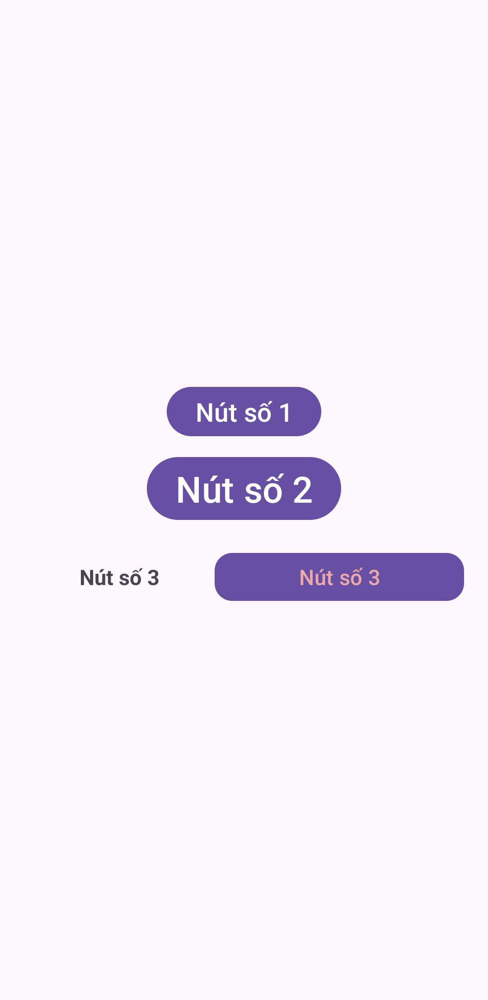

### Ex3 SimpleSumApp

  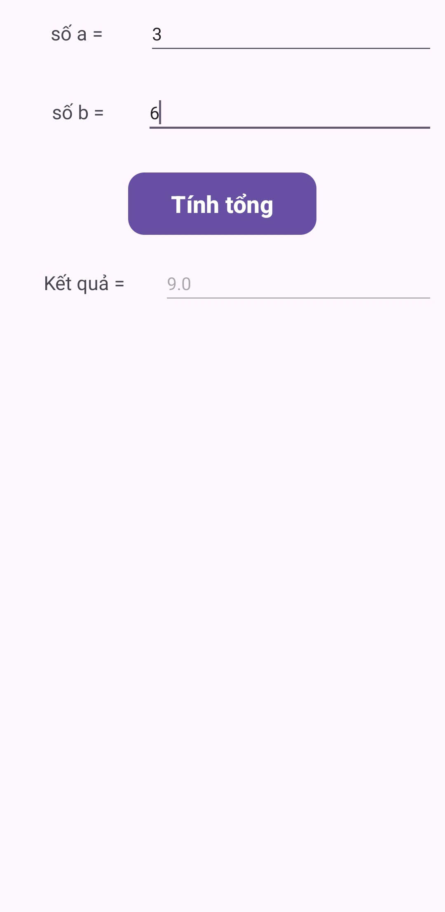
  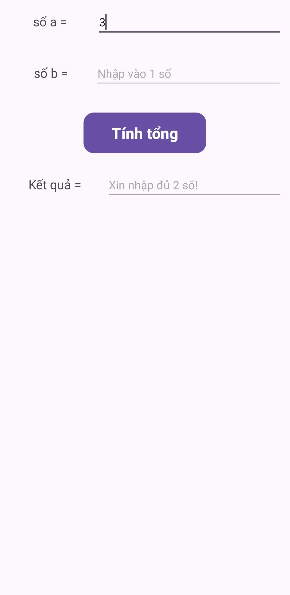
  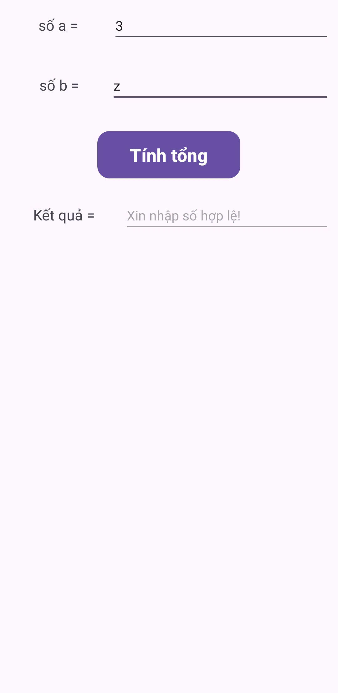

### Ex4 and Ex5 AddSubMulDiv

  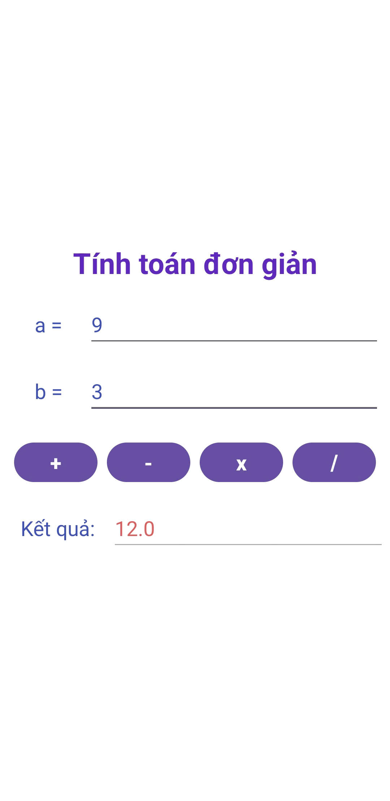
  
  
  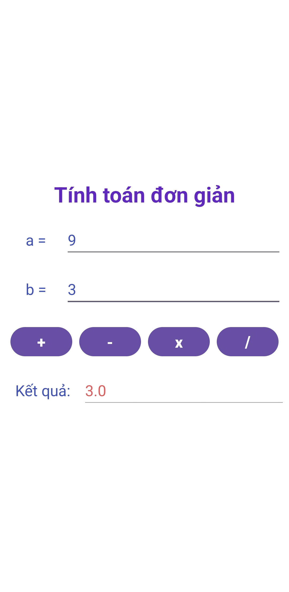

### Tính BMI

  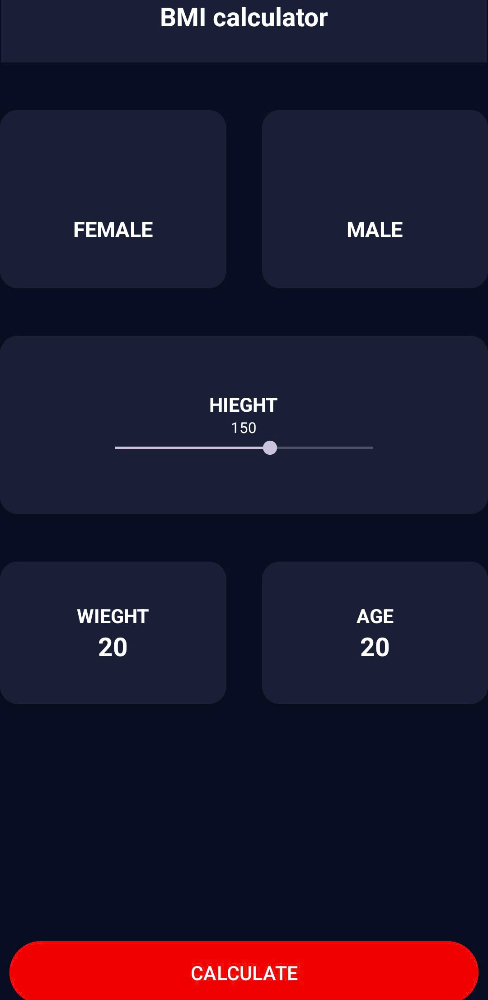

### Ex6 IntentDonGian

  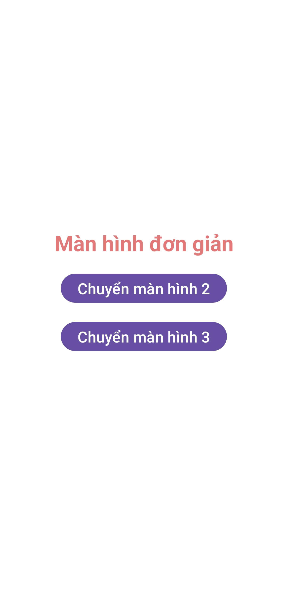
  
  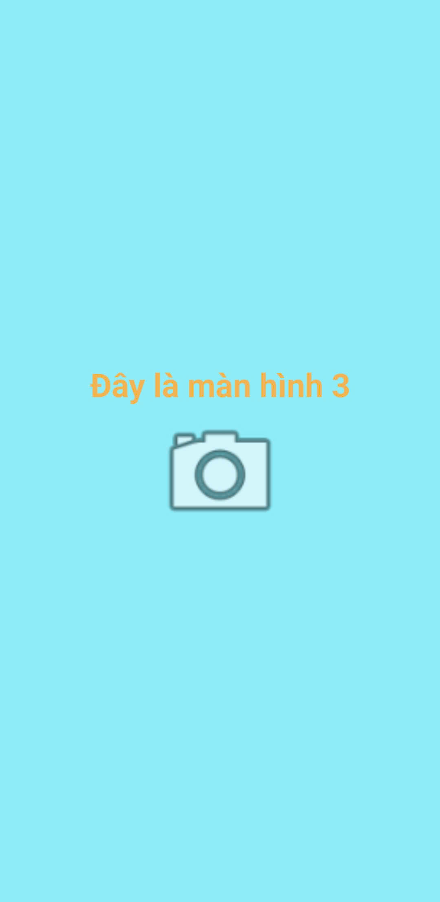

### Ex7 IntentLogin

  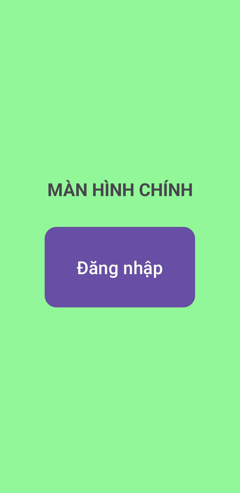
  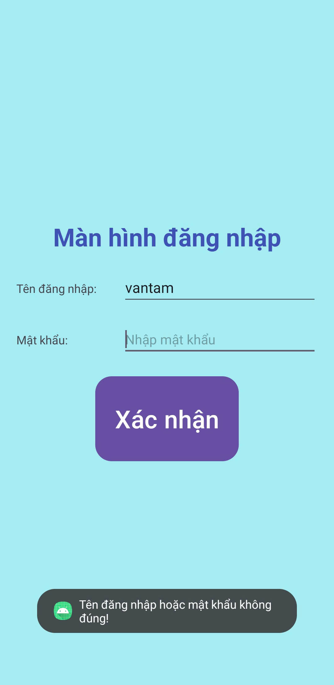
  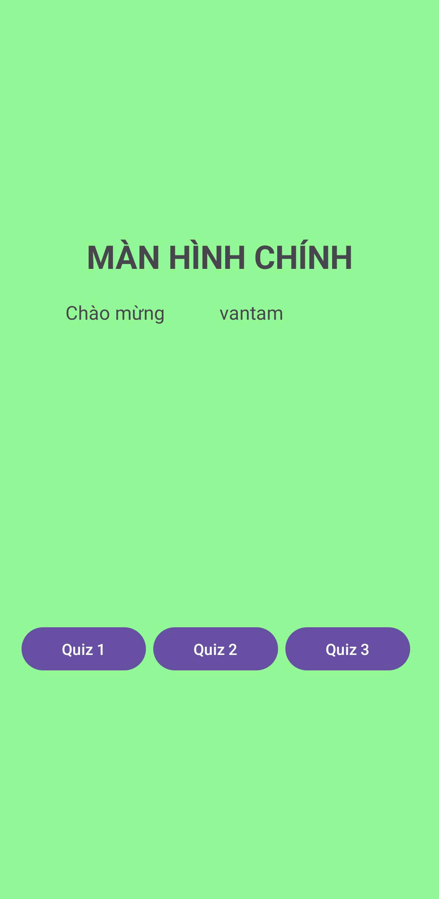

### Listview Danh sách bài hát

  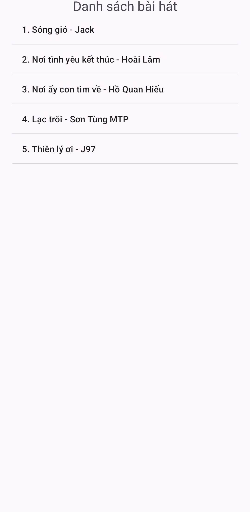
  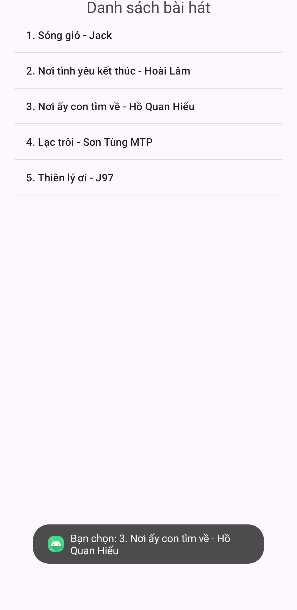
  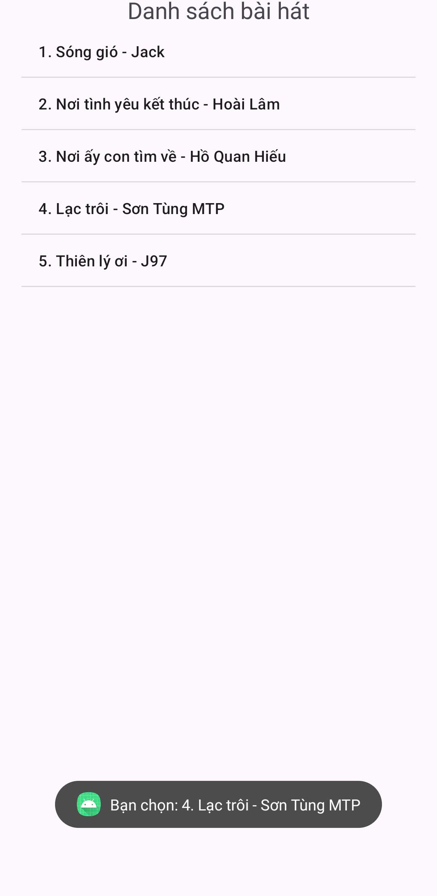

### Bài 1 - Kid learning app (figma)

  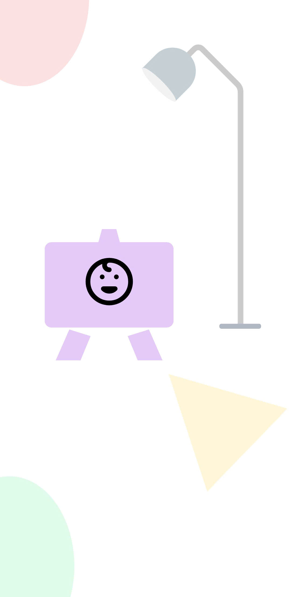
  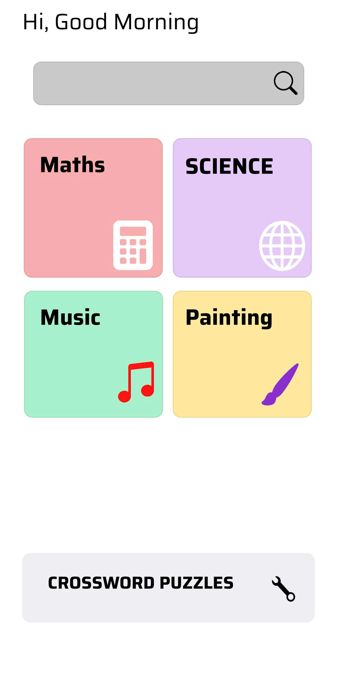

